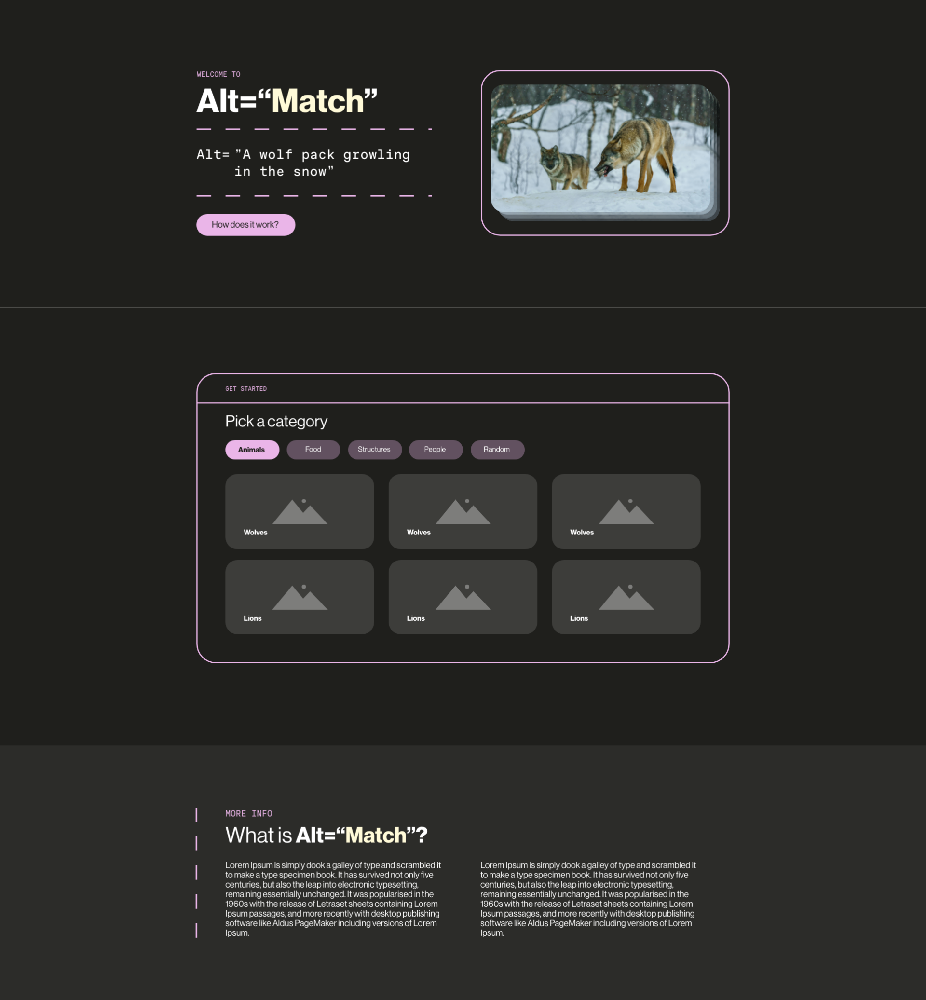
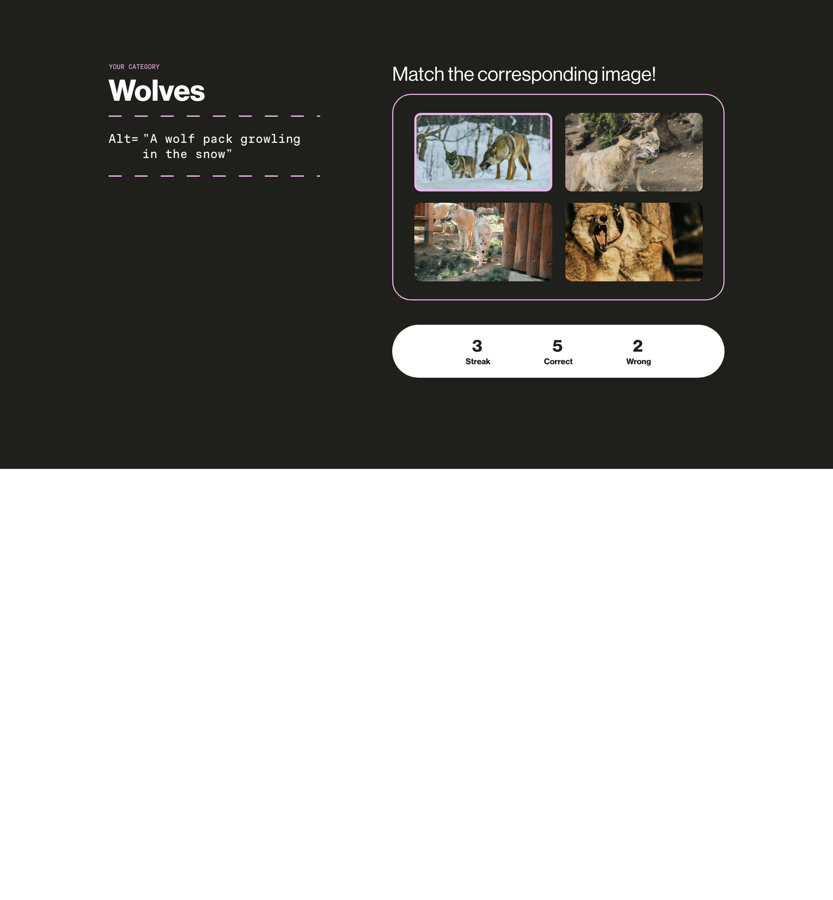
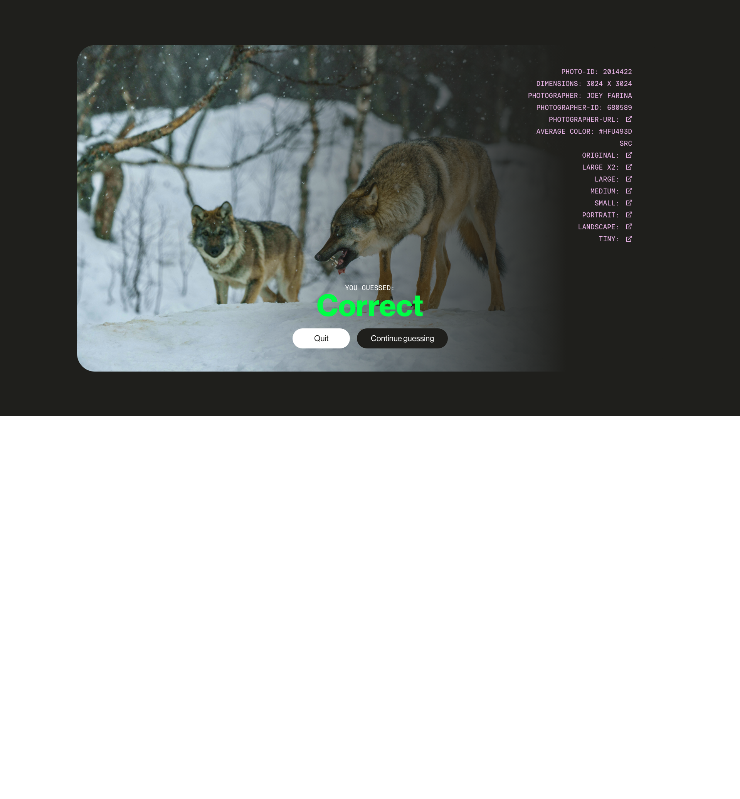

# API   David Bijl

 
 
 

> ## Week 1
> **31 mar t/m 4 apr**

**Opdracht omschrijving:**  
In dit vak zullen we een van de meest voorkomende app-concepten van vandaag gebruiken en ontdekken dat we deze kunnen maken met moderne webtechnologie met als doel om een rijke gebruikerservaring creëeren.  

Aan het begin van deze week ben ik bezig geweest met het kiezen van een content API en verschillende web API's. Na wat rond te kijken wat er allemaal mogelijk was heb ik besloten de pexels API te kiezen. Mijn idee is namelijk om een kleine minigame te bouwen waarbij de gebruiker een selectie plaatjes te zien krijgt en 1 alt tag. Vervolgens moet de gebruiker het bijbehoorende plaatjes uit de selectie kiezen. Als de gebruiker juist kiest dan krijgt gaat zijn score omhoog en als de gebruiker fout kiest dan daalt zijn score.

Om de score van de gebruiker bij te houden lijkt het mij handig om een local storage web API te gebruiken. Daarnaast als 2e web API wil ik view transitions toepassen. Tot zover mijn concept.
Om een beter idee van de layout te krijgen ben ik begonnen met een design maken in adobe XD.  

 
Het design is relatief simpel, het bestaat uit een begin pagina, game pagina en een detail pagina. De begin pagina geeft een korte intro over wat het project is met uitleg en op deze pagina kan de gebruiker een categorie voor het spel.

---

 
 
 

> ## Week 2
> **7 t/m 11 apr**

---

 
 
 

> ## Week 3
> **14 t/m 17 apr**

---

 
 
 

> ## Week 4
> **22 t/m 25 apr**

---

 
 
 

> ## Bronnen

<ul>
    <li>https://waywithwords.net/resource/accessible-captions-for-hearing-impaired/</li>
    <li>https://dl.acm.org/doi/10.1145/3544548.3581130</li>
    <li>https://www.youtube.com/watch?v=hTImdpMJ4dE</li>
    <li>https://arxiv.org/pdf/2012.13265</li>
</ul>

---